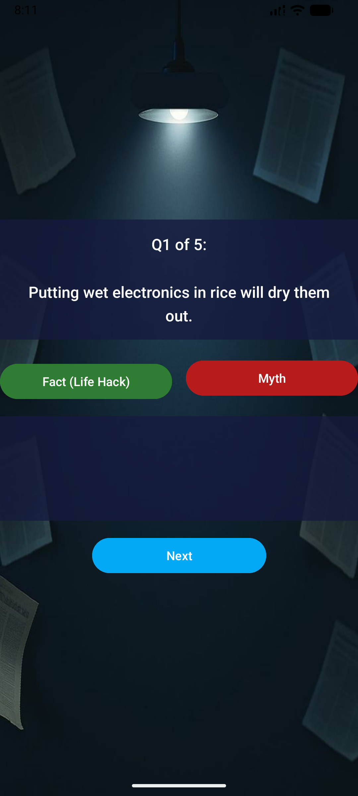
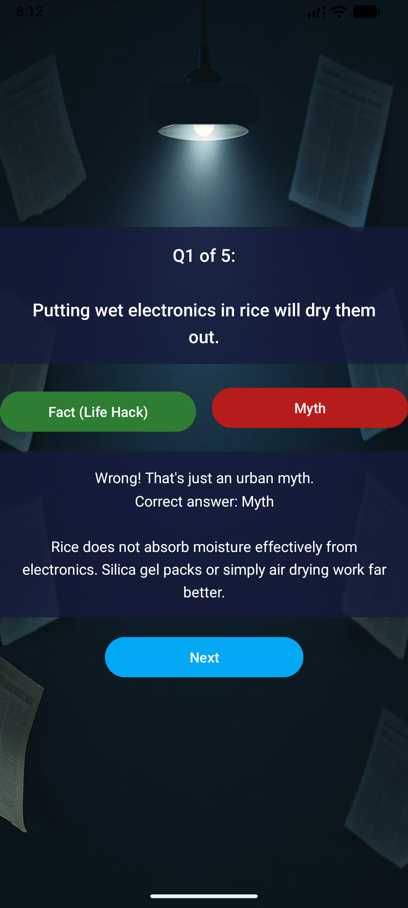

# Life Hack or Urban Myth?

A native Android app built with Kotlin in Android Studio that challenges users to distinguish real life hacks from urban myths through a 5-question flashcard quiz.

---

## Purpose

Life hacks and internet rumours are everywhere. This app helps users test their common knowledge and learn useful, real-world shortcuts by presenting statements and asking is it: **Fact or Myth?**

---

## Screens

### Screen 1 – Welcome Screen
- Displays the app title and a short description of the game.
- A **Start Quiz** button navigates to the flashcard screen.

### Screen 2 – Flashcard Question Screen
- Shows one statement at a time (e.g. *"Putting wet electronics in rice will dry them out."*).
- The user taps **Fact (Life Hack)** or **Myth** to answer.
- Immediate feedback is shown after each answer, including an explanation of why it is a fact or myth.
- A **Next** button (labelled **See Results** on the final question) advances through the quiz.

### Screen 3 – Score Screen
- Displays the total number of correct answers out of 5.
- Shows personalised feedback based on the score:
  - 5/5 → **Master Hacker! Perfect score!**
  - 4/5 → **Hack Savvy! Almost perfect!**
  - 3/5 → **Pretty Sharp! A few myths slipped through.**
  - 2/5 → **Getting There! Keep practising.**
  - 0–1/5 → **Stay Safe Online! Study up and try again.**
- A **Review All Answers** button reveals every question, its correct answer, and its explanation.
- **Play Again** restarts the quiz; **Exit** closes the app.

---

## Screenshots

### Welcome Screen

### Quiz Screen – Question

### Quiz Screen – Correct Answer

### Quiz Screen – Wrong Answer

### Score Screen

---

## Design Considerations

- **ConstraintLayout** is used for all screens to ensure the UI scales correctly across different screen sizes and orientations.
- Screen 3 is wrapped in a **ScrollView** so the review list can be scrolled on smaller devices.
- `Log.d()` statements are used throughout all three activities to log navigation events, user answers, and score calculations — demonstrating understanding of app flow.
- All answer buttons are disabled after the user picks an answer to prevent double-tapping.
- The app passes the full question/answer/explanation arrays via `Intent` extras so Screen 3 can display the complete review without duplicating data.

---

## Application Logic

1. The quiz iterates through an array of 5 questions using an index counter (`currentQuestionIndex`).
2. After each answer, `checkAnswer()` compares the user's choice to `correctAnswers[currentQuestionIndex]` and increments `score` if correct.
3. After the last question, `moveToNextQuestion()` navigates to `MainActivity3` and passes the score data as Intent extras.
4. `MainActivity3` reads the extras and uses a `when` expression to select the personalised feedback message.

---

## Version Control – GitHub

This project uses **Git** and **GitHub** for version control.

- The repository was initialised with this README file.
- Code is committed and pushed regularly as features are completed.
- Commit messages describe what was changed and why.

---

## Automated Builds – GitHub Actions

A **GitHub Actions** workflow (`.github/workflows/build.yml`) automatically:

1. Checks out the code on every push or pull request to `main`.
2. Sets up JDK 17.
3. Runs the unit tests (`./gradlew test`).
4. Builds the debug APK (`./gradlew assembleDebug`).
5. Uploads the resulting APK as a downloadable build artifact.

This ensures the app compiles correctly on a clean machine after every change, not just on the developer's local setup.

Reference guide used: [Automated Android Build with GitHub Actions](https://github.com/marketplace/actions/automated-build-android-app-with-github-action)

---

## Video Presentation

> **[Add your YouTube link here once uploaded]**

The video walks through all three screens, demonstrates correct and incorrect answers, the personalised feedback system, and the review list feature.

---

## How to Run

1. Clone the repository.
2. Open the `mithOrfact` folder in **Android Studio**.
3. Let Gradle sync finish.
4. Run the app on an emulator or physical device (minSdk 24 / Android 7.0+).
